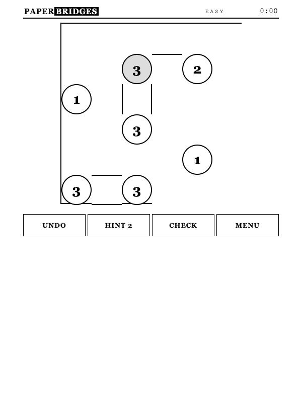

# PaperBridges

Offline Hashiwokakero (bridges) with unlimited unique puzzles, designed for
Kindle e-ink browsers.

<p align="center">
  
</p>

## What it is

A self-contained bridges puzzle with its own solver and generator. One page,
one screen, no scrolling, no network calls — everything runs locally in the
browser.

Every puzzle is generated on the device when you press NEW GAME and is
guaranteed to have exactly one solution; served puzzles are hashed and
remembered, so you never play the same one twice.

## Rules

Connect islands (numbered circles) with bridges so that:

- the bridges on each island match its number
- one or two bridges may run between two aligned islands
- bridges run horizontally or vertically and never cross
- every island is reachable from every other island

Tap any cell on the line between two islands to cycle 0 → 1 → 2 → 0 bridges.
Tapping an island itself does nothing; aim for the gap between.

## Kindle-first design

- **ES5, zero dependencies** — runs on old WebKit
- **Unlimited puzzles** — generated locally, uniqueness-verified by solver
- **Never repeats** — every served puzzle is hashed and remembered (up to 500)
- **Partial repaints** — only changed cells redraw
- **Big targets** — full grid cells are the tap area, 44px+ buttons
- **Lazy clock** — no per-second repaints; e-ink friendly
- **Autosave** — puzzle, bridges, and stats use guarded localStorage

## Difficulty

| Level  | Grid  | Hints |
|--------|-------|-------|
| Easy   | 6×6   | 3     |
| Medium | 7×7   | 2     |
| Hard   | 8×8   | 1     |
| Expert | 9×9   | 0 |

UNDO steps back through bridges and hints; CHECK flags bridges that differ
from the unique solution; hinted bridges lock in place.

## Architecture

- [`index.html`](index.html) — application entry point
- [`js/engine.js`](js/engine.js) — solver (uniqueness by solution counting) and generator
- [`js/app.js`](js/app.js) — interface and game flow
- [`css/paperbridges.css`](css/paperbridges.css) — Kindle-first presentation
- [`tests/`](tests/) — node scripts: geometry, solver, 60-puzzle suite

```bash
node tests/engine.js   # engine correctness
./serve.sh             # LAN serve for Kindle
```

## Contributing

Issues and pull requests are welcome. Keep changes dependency-free, compatible
with ES5-era WebKit, and usable on slow grayscale e-ink displays.

## License

PaperBridges is available under the [MIT License](LICENSE).

---

Made by [8ugust.dev](https://8ugust.dev)
